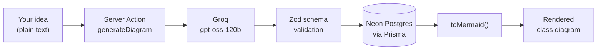

<div align="center">

# ArchiGen AI

**Turn a paragraph into a UML class diagram.**

Describe your software project in plain English. ArchiGen infers the classes, their
attributes and methods, and the relationships between them — then renders it as a
Mermaid class diagram and saves it to your workspace.

[](https://nextjs.org)
[](https://react.dev)
[](https://www.typescriptlang.org)
[](https://www.prisma.io)
[](https://neon.tech)
[](https://clerk.com)
[](https://tailwindcss.com)

</div>

---

## Contents

- [Why](#why)
- [Features](#features)
- [How it works](#how-it-works)
- [Tech stack](#tech-stack)
- [Getting started](#getting-started)
- [Environment variables](#environment-variables)
- [Scripts](#scripts)
- [Project structure](#project-structure)
- [Data model](#data-model)
- [Security model](#security-model)
- [Testing](#testing)
- [Deploying](#deploying)
- [Version notes](#version-notes)
- [Roadmap](#roadmap)

---

## Why

The gap between "I know what I want to build" and "I have an object model" is where
most student projects stall. You end up dragging boxes around in a diagram tool,
guessing at cardinality, and redrawing the whole thing when the design shifts.

ArchiGen closes that gap. You write four lines about your system; it returns a
structured, schema-validated class model you can read, critique, and iterate on.

---

## Features

| | |
|---|---|
| **Plain English in, UML out** | Describe the system the way you'd explain it to a teammate. No modelling notation to learn first. |
| **Structured, not guessed** | Every response is validated against a Zod schema via `generateObject`, so classes, attributes, methods and relationships always come back well-formed — or not at all. |
| **Real Mermaid diagrams** | Output renders as a live Mermaid class diagram, themed to match the app, ready to screenshot or paste into a report. |
| **Four relationship types** | Association, inheritance, aggregation and composition — mapped to the correct UML arrowheads (`-->`, `<\|--`, `o--`, `*--`). |
| **Saved to your workspace** | Every diagram is persisted to Neon Postgres against your account, so you can revisit and compare iterations. |
| **JSON you can build on** | The raw model sits next to the diagram, one click from your clipboard, ready to feed into codegen or your own tooling. |
| **Auth that actually gates** | Clerk protects the dashboard at the proxy layer *and* inside every server action and route handler. |
| **Durable rate limiting** | 10 generations per hour and 40 per day per user, tracked in Postgres so the limit survives cold starts and holds across serverless instances. |
| **Graceful failure** | Error boundaries at the app, dashboard and root-layout level, plus skeleton loading states for the database-backed routes. |

---

## How it works



1. **You describe the system.** A few sentences on who uses it and what they do.
2. **The model designs it.** `generateObject` from the AI SDK calls Groq with a system
   prompt and the `umlSchema`, so the response is forced into shape rather than parsed
   out of prose.
3. **It gets saved.** The validated object is written to Neon as a `Json` column, keyed
   to your Clerk user id.
4. **It gets drawn.** [`lib/mermaid.ts`](lib/mermaid.ts) converts the model to Mermaid
   `classDiagram` source, which renders client-side.

Reads re-validate the stored JSON, so a row written under an older schema is skipped
rather than crashing the page.

---

## Tech stack

| Layer | Choice | Notes |
|---|---|---|
| Framework | **Next.js 16.3** (App Router, Turbopack) | Server Components by default; `proxy.ts` replaces `middleware.ts` |
| UI | **React 19.2** + **Tailwind CSS 4** | `useActionState` / `useFormStatus` for form state; CSS-first Tailwind config in `globals.css` |
| Auth | **Clerk 7 (Core 3)** | `<Show>` control component; `clerkMiddleware` + `auth.protect()` |
| Database | **Neon** serverless Postgres | WebSocket driver, pooled |
| ORM | **Prisma 7** | Query compiler + `@prisma/adapter-neon` driver adapter |
| AI | **Vercel AI SDK 7** + **Groq** | `openai/gpt-oss-120b`, structured output via `generateObject` |
| Validation | **Zod 4** | One schema shared by the model, the API and the read path |
| Diagrams | **Mermaid 11** | `classDiagram`, themed with custom `themeVariables` |

---

## Getting started

### Prerequisites

- **Node.js 20+** (developed on 24)
- **pnpm** (the repo ships a `pnpm-lock.yaml`)
- A **[Neon](https://neon.tech)** project — free tier is plenty
- A **[Clerk](https://clerk.com)** application
- A **[Groq](https://console.groq.com)** API key

### 1. Clone and install

```bash
git clone https://github.com/shreeteja172/ArchiGen-AI.git
```

```bash
cd ArchiGen-AI && pnpm install
```

`postinstall` runs `prisma generate` for you — the Prisma client is generated into
`lib/generated/prisma` and is **not** committed.

### 2. Configure the environment

Create a `.env` in the project root — see [Environment variables](#environment-variables)
for the full list:

```bash
cp .env.example .env
```

### 3. Apply the schema to Neon

```bash
pnpm db:deploy
```

### 4. Run it

```bash
pnpm dev
```

Open [http://localhost:3000](http://localhost:3000). The landing page is public; sign up
to reach `/dashboard`.

> **Note**
> Next.js 16 refuses to start a second `next dev` for the same directory. If you see
> *"Another next dev server is already running"*, stop the existing one first.

---

## Environment variables

| Variable | Required | Example | Purpose |
|---|:---:|---|---|
| `DATABASE_URL` | ✅ | `postgresql://…@ep-….neon.tech/neondb?sslmode=require` | Neon connection string (pooled) |
| `GROQ_API_KEY` | ✅ | `gsk_…` | Groq API key for generation |
| `NEXT_PUBLIC_CLERK_PUBLISHABLE_KEY` | ✅ | `pk_test_…` | Clerk frontend key |
| `CLERK_SECRET_KEY` | ✅ | `sk_test_…` | Clerk backend key |
| `NEXT_PUBLIC_CLERK_SIGN_IN_URL` | | `/sign-in` | Where Clerk sends unauthenticated users |
| `NEXT_PUBLIC_CLERK_SIGN_UP_URL` | | `/sign-up` | Sign-up route |
| `NEXT_PUBLIC_CLERK_SIGN_IN_FALLBACK_REDIRECT_URL` | | `/dashboard` | Landing spot after sign-in |
| `NEXT_PUBLIC_CLERK_SIGN_UP_FALLBACK_REDIRECT_URL` | | `/dashboard` | Landing spot after sign-up |

> **Warning**
> Prisma 7 no longer auto-loads `.env`. [`prisma.config.ts`](prisma.config.ts) imports
> `dotenv/config` explicitly so the CLI can resolve `DATABASE_URL` — don't remove that
> import.

---

## Scripts

| Command | What it does |
|---|---|
| `pnpm dev` | Start the dev server on :3000 |
| `pnpm build` | `prisma generate` then a production build |
| `pnpm start` | Serve the production build |
| `pnpm lint` | ESLint across the repo |
| `pnpm test` | Run the Vitest suite once |
| `pnpm test:watch` | Run tests in watch mode |
| `pnpm typecheck` | `tsc --noEmit` |
| `pnpm db:migrate` | Create and apply a migration in development |
| `pnpm db:deploy` | Apply pending migrations (production / CI) |
| `pnpm db:push` | Sync `schema.prisma` to Neon without a migration file |
| `pnpm db:studio` | Open Prisma Studio against your database |

---

## Project structure

```
archigen/
├── app/
│   ├── page.tsx                       # Public marketing landing page
│   ├── layout.tsx                     # Root layout, ClerkProvider, theming
│   ├── globals.css                    # Tailwind 4 theme tokens + custom utilities
│   ├── error.tsx                      # App-level error boundary
│   ├── global-error.tsx               # Root-layout failures (own html/body)
│   ├── not-found.tsx                  # 404 page
│   ├── actions/diagrams.ts            # Server Actions: generate, delete
│   ├── api/generate/route.ts          # Authenticated JSON endpoint
│   ├── dashboard/
│   │   ├── layout.tsx                 # App chrome, UserButton
│   │   ├── page.tsx                   # Generator + saved diagrams
│   │   ├── loading.tsx                # Skeleton while the DB responds
│   │   ├── error.tsx                  # Dashboard error boundary
│   │   └── diagrams/[id]/             # Single diagram: render, JSON, delete
│   └── sign-in, sign-up/              # Clerk catch-all routes
├── components/
│   ├── MermaidDiagram.tsx             # Client-side Mermaid renderer
│   ├── dashboard/                     # GeneratorForm, CopyButton, DeleteDiagramButton
│   └── landing/                       # Logo, DiagramPreview
├── lib/
│   ├── ai/                            # models.ts, prompt.ts, schema.ts
│   ├── db.ts                          # Prisma client singleton + Neon adapter
│   ├── diagrams.ts                    # User-scoped read queries
│   ├── rate-limit.ts                  # Per-user generation quotas
│   └── mermaid.ts                     # UML model → Mermaid source
├── prisma/
│   ├── schema.prisma
│   └── migrations/                    # Migration history (baselined at 0_init)
├── prisma.config.ts                   # Prisma 7 config (datasource URL lives here)
└── proxy.ts                           # Clerk middleware (Next 16 naming)
```

---

## Data model

```prisma
model Diagram {
  id        String   @id @default(cuid())
  userId    String
  title     String
  idea      String
  uml       Json
  createdAt DateTime @default(now())
  updatedAt DateTime @updatedAt

  @@index([userId, createdAt(sort: Desc)])
}
```

```prisma
model GenerationEvent {
  id        String   @id @default(cuid())
  userId    String
  createdAt DateTime @default(now())

  @@index([userId, createdAt])
}
```

`uml` stores the full validated object — classes, attributes, methods and relationships
— so the diagram can be re-rendered or re-exported without another model call. The
composite index matches the dashboard's "my diagrams, newest first" query.

`GenerationEvent` records one row per generation *attempt*. Keeping it separate from
`Diagram` means deleting a diagram doesn't refund quota, and a failed model call still
counts — which is the behaviour you want, since the API call is what costs money.

---

## Security model

Authorization is enforced in three places, not one:

1. **`proxy.ts`** — `auth.protect()` gates `/dashboard/*` and `/api/generate/*` before a
   request reaches a route.
2. **Server Actions and route handlers** — each re-checks the session, because Server
   Actions are reachable by direct `POST` regardless of what the UI renders.
3. **Every query** — reads and deletes filter on `userId` alongside the record id, so a
   guessed or forged diagram id returns nothing rather than someone else's data.

Generation is additionally capped per user (see `lib/rate-limit.ts`), so a compromised
or simply enthusiastic account can't drain the Groq key.

---

## Testing

```bash
pnpm test
```

Vitest covers the pure logic that's cheapest to break and most annoying to debug:

- **`lib/mermaid.test.ts`** — every relationship type maps to the right UML arrow, and
  class bodies render attributes and methods correctly.
- **`lib/ai/schema.test.ts`** — the Zod contract rejects unknown relationship types,
  missing titles and wrong attribute types.
- **`lib/rate-limit.test.ts`** — the quota allows the last request under the limit,
  blocks at the limit, enforces the daily cap independently, and scopes every count to
  a single user. Prisma is mocked, so it runs without a database.

CI (`.github/workflows/ci.yml`) runs lint, typecheck, tests and a production build on
every push and pull request.

---

## Deploying

The app runs anywhere Next.js 16 does; Vercel is the smoothest path.

1. Push to GitHub and import the repo.
2. Add every variable from [Environment variables](#environment-variables) to the
   project settings.
3. Deploy. The `build` script runs `prisma generate` first, so the generated client
   doesn't need to be committed.
4. Run `pnpm db:deploy` against your production branch to apply migrations, or promote
   a Neon branch that already has the schema.

Neon's serverless driver connects over WebSockets, so this works on serverless
runtimes without connection-pool exhaustion.

---

## Version notes

Three dependencies here diverge sharply from what older tutorials (and most LLMs) will
tell you. If something looks unfamiliar, this is why:

- **Clerk 7 is "Core 3"** (March 2026). `<SignedIn>`, `<SignedOut>` and `<Protect>` were
  removed — they now throw at render. Use
  `<Show when="signed-in" fallback={…}>` instead. Appearance variables were renamed too
  (`colorForeground`, `colorMuted`, `colorInput`).
- **Prisma 7** dropped `url = env("DATABASE_URL")` from the `datasource` block; the
  connection URL lives only in `prisma.config.ts`. A driver adapter is now mandatory,
  and the generated client is TypeScript source rather than a binary in `node_modules`.
- **Next.js 16** renamed `middleware.ts` to **`proxy.ts`**. The bundled docs in
  `node_modules/next/dist/docs/` are the source of truth for this version.

---

## Roadmap

- [ ] Error tracking (Sentry or similar) — needs a project DSN
- [ ] Regenerate a diagram in place, keeping version history
- [ ] Export to PNG / SVG
- [ ] Sequence and use-case diagrams alongside class diagrams
- [ ] Editable models — tweak a class without a full regeneration
- [ ] Shareable read-only diagram links

---

<div align="center">

Built by [@shreeteja172](https://github.com/shreeteja172)

</div>
